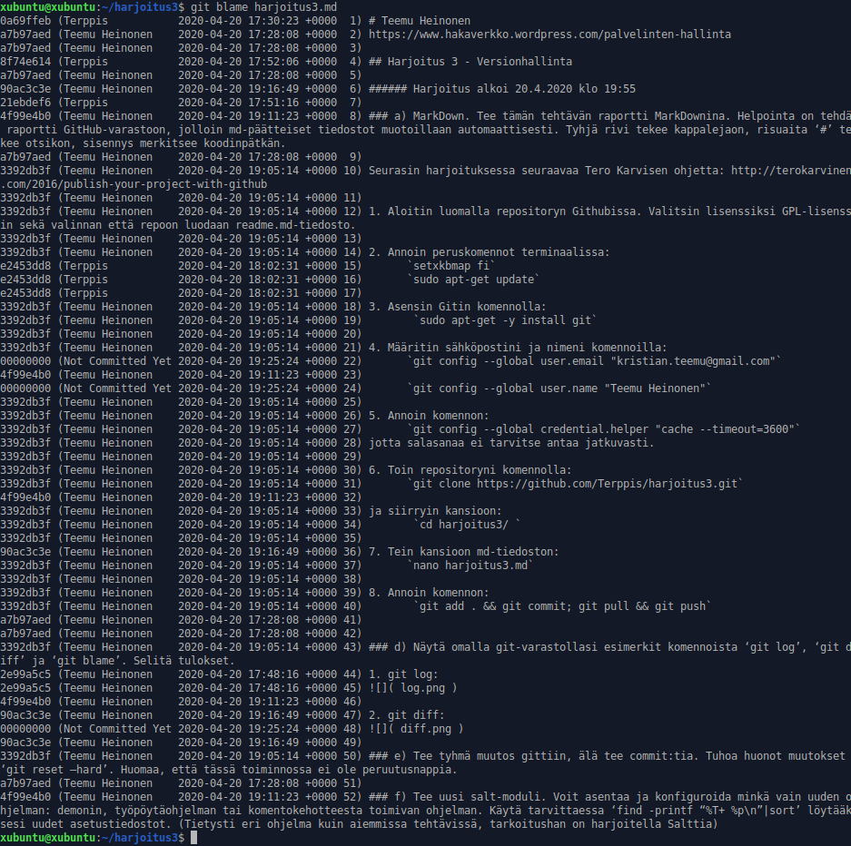
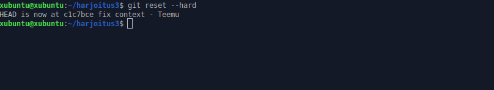

# Teemu Heinonen
https://www.hakaverkko.wordpress.com/palvelinten-hallinta

## Harjoitus 3 - Versionhallinta

###### Harjoitus alkoi 20.4.2020 klo 19:55
 
### a) MarkDown. Tee tämän tehtävän raportti MarkDownina. Helpointa on tehdä raportti GitHub-varastoon, jolloin md-päätteiset tiedostot muotoillaan automaattisesti. Tyhjä rivi tekee kappalejaon, risuaita ‘#’ tekee otsikon, sisennys merkitsee koodinpätkän.

Seurasin harjoituksessa seuraavaa Tero Karvisen ohjetta: http://terokarvinen.com/2016/publish-your-project-with-github

1. Aloitin luomalla repositoryn Githubissa. Valitsin lisenssiksi GPL-lisenssin sekä valinnan että repoon luodaan readme.md-tiedosto. 

2. Annoin peruskomennot terminaalissa:
	`setxkbmap fi`
	`sudo apt-get update`

3. Asensin Gitin komennolla:
	 `sudo apt-get -y install git`

4. Määritin sähköpostini ja nimeni komennoilla:
	`git config --global user.email "kristian.teemu@gmail.com"`

	`git config --global user.name "Teemu Heinonen"`

5. Annoin komennon:
	`git config --global credential.helper "cache --timeout=3600"`
jotta salasanaa ei tarvitse antaa jatkuvasti.

6. Toin repositoryni komennolla:
	`git clone https://github.com/Terppis/harjoitus3.git`

ja siirryin kansioon:
	 `cd harjoitus3/ `

7. Tein kansioon md-tiedoston:
	`nano harjoitus3.md`

8. Annoin komennon:
	 `git add . && git commit; git pull && git push`

### d) Näytä omalla git-varastollasi esimerkit komennoista ‘git log’, ‘git diff’ ja ‘git blame’. Selitä tulokset.
1.`git log`

2.`git diff`
 

3.`git blame harjoitus3.md`

### e) Tee tyhmä muutos gittiin, älä tee commit:tia. Tuhoa huonot muutokset ‘git reset –hard’. Huomaa, että tässä toiminnossa ei ole peruutusnappia.
1. Lisäsin harjoitus.md-tiedostoon kohdan "Testataan tyhmää muutosta"
2. Annoin komennon: `git reset --hard `

### f) Tee uusi salt-moduli. Voit asentaa ja konfiguroida minkä vain uuden ohjelman: demonin, työpöytäohjelman tai komentokehotteesta toimivan ohjelman. Käytä tarvittaessa ‘find -printf “%T+ %p\n”|sort’ löytääksesi uudet asetustiedostot. (Tietysti eri ohjelma kuin aiemmissa tehtävissä, tarkoitushan on harjoitella Salttia)

Seurataan edellisen harjoitukseni kohdan a) ja b) ohjeita:

https://hakaverkko.wordpress.com/2020/04/06/ph-harjoitus-1/
